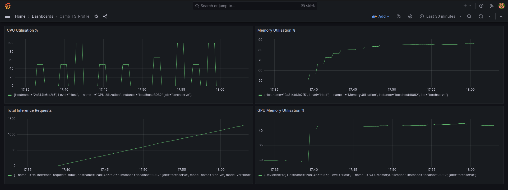

# CambAI Takehome Challenge


## Description
I created a very thorough readme file explainig word for word everything I had done and struggled with, but due to my excellent git proficiency I managed to lose all of that, so this slightly stripped-down version will have to suffice because I am out of time. 

## Requirements
- Python 3.10 or greater.
- Pytorch 2.1.0 and the corresponding torchaudio version, if you want to do inference with real audio.

## Getting Started
I created a docker container with everything ready to go. Run the following commands:

```shell
# get the container image
docker pull dewet99/knn_vc_camb_wm:latest

# run it 
sudo docker run --gpus 1 --rm -it -p 127.0.0.1:8080:8080 -p 127.0.0.1:8081:8081 -p 127.0.0.1:8082:8082 --name knn_vc dewet99/knn_vc_camb_wm:latest

# register the knn_vc models - it is already included in the container
curl -X POST "localhost:8081/models?model_name=knn_vc&url=/home/model-server/model-store/model_store/knn_vc.mar&initial_workers=1"

```
Successfully registering the models should show the following in the terminal:
```shell
{
  "status": "Model \"knn_vc\" Version: 1.0 registered with 1 initial workers"
}
```
You can now start doing inference.

## Inference
We have two kinds of inputs: Noise and audio. Running a stress test with audio will cause an out-of-memory error, because the number of inputs can become quite high. We used random noise as source and targets for inference.
```shell
bash ./simulate_stress_test.sh --num_requests --model_name --dataset_relative_path --input_type

```
The args are as follows:
- `--num_requests`: How many inference requests to generate
- `--model_name`: knn_vc, it's the only one in the container
- `--dataset_relative_path`: Path to the LibriSpeech dataset for inferring with actual audio
- `--input_type`: noise or audio
   
The following command will run a stress test wtih 1000 inference requests, consisting of source and target clips of random noise:
```shell
bash ./simulate_stress_test.sh 1000 knn_vc ./datasets/LibriSpeech/test-clean noise
```

Inferring with actual audio requires the LibriSpeech test-clean set. You can download and install it with the following command:
```shell
bash ./get_speech
```
In theory, that should download and extract the dataset to the correct location. Can then do a stress test with real audio using the following command:
```shell
bash ./simulate_stress_test.sh 1000 knn_vc ./datasets/LibriSpeech/test-clean audio
```
This caused my PC to run out of memory, I did not have time to investigate whether it was a memory leak or just due to incorrect config options in terms of allocated RAM.
The output data does not get saved, for either noise or real audio. Simply comment and uncomment the relevant lines in the `simulate_stress_test.sh` script to change this. We had some storage issues, hence this measure.

## Stress Test Results
We do a stress test with the following command:
```shell
bash ./simulate_stress_test.sh 1000 knn_vc ./datasets/LibriSpeech/test-clean noise
```
The torchserve container sends metrics to a Prometheus server via the provided metrics API, and we visualise it with Grafana. Note that the CPU Utilisation graph is not accurate. Prometheus sends a request every five seconds (in our config), so this is the CPU usage at 5 second intervals. Sometimes that will be between inference calls, sometimes it will be during, so it is not accurate. An expression in Grafana could be done to properly display CPU usage over time, but we did not have time.


## Some Notes:
A brief summary of the process that can be taken to achieve the same result. Assuming you have some knowledge of how to Google or ask ChatGPT, the following should be sufficient to reproduce my work. 
1. Clone the knn_vc (https://github.com/bshall/knn-vc) and torchserve (https://github.com/pytorch/serve) repos
2. Run the example notebook provided by knn_vc, and save the `knn_vc.state_dict()` to a .pth file. This is because the torchserve model archiver needs the .pth file to create a .mar file.
3. Create a custom handler - mine is knn_vc_handler.py. See (https://pytorch.org/serve/custom_service.html) to understand the why.
4. Create the torchserve docker image (tutorial at https://github.com/pytorch/serve/tree/master/docker).
5. Run the docker image and map the following into directories of your choosing within the docker container:
   - the saved .pth file
   - the custom handler.py file
   - the matcher.py from the knn_vc repo
6. With that done, you can run the torchserve model archiver from within the docker container. This is also explained at (https://github.com/pytorch/serve/tree/master/docker)
7. Register the .mar file using curl, as we did above. The exact command might change depending on where you saved the .mar file.
8. You are now ready for inference, I think.

Some notes about the noise generated for the stress test:
1. Source clip is of random length, between 3 and 10 seconds.
2. Target clips are of random length, also between 3 and 10 seconds each.
3. The number of target clips can range between 1 and 10.
